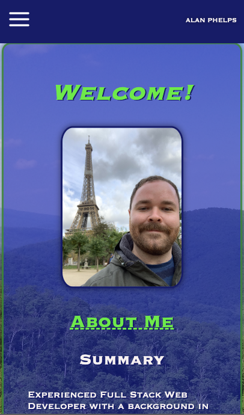

# phelps-portfolio-yes-indeed

## Description

This is a web development portfolio for me, Alan Phelps, showcasing who I am and the work I have done so far in this field.

## Table of Contents

- [Usage](#usage)
- [Screenshot](#screenshot)
- [Questions](#questions)

## Usage

This application is to be used to see what projects I have completed as a web developer, view my resume, find my relevant social media profiles, or contact me with questions or business inquiries.

## Screenshot

## Questions

- GitHub: [sora64](https://github.com/sora64/)

- Email: If you have any other questions, please reach me at [phelpsa64@gmail.com](mailto:phelpsa64@gmail.com).
